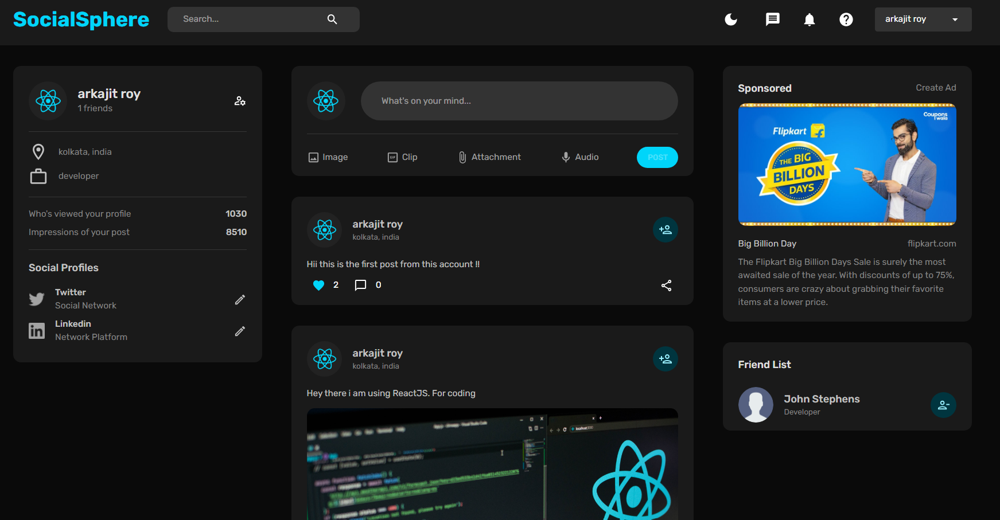
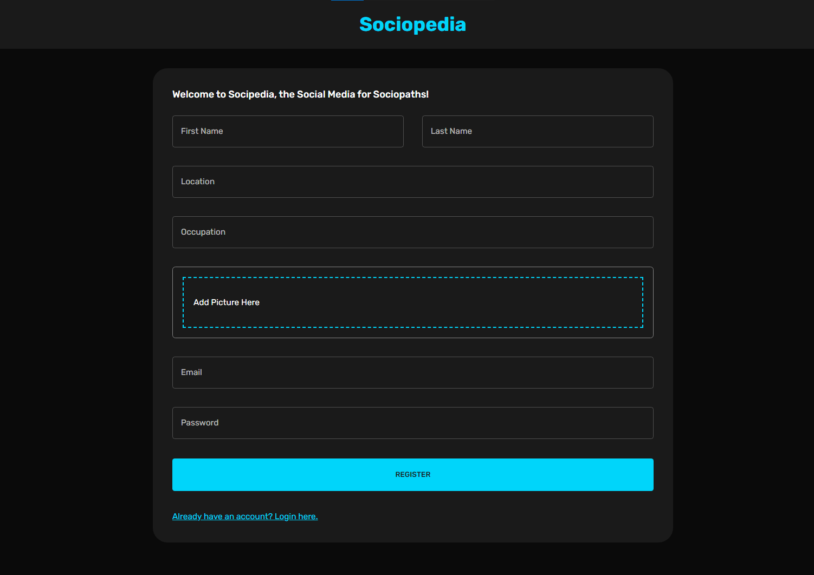

## SocialSphere-MERN

So, this is a social media app that covers all the fundamental functions that a social media app should.

#### :hammer_and_wrench: Tech-Stack

| Technology     | About the Framework/ Technology                         |
| -------------- | ------------------------------------------------------- |
| **React-JS**   | For making frontend components and pages                |
| **Formik-JS**  | Formik is a popular library for creating forms in react |
| **Node-JS**    | NodeJS is used for backend                              |
| **Express-JS** | It has been used for making the backend-server          |
| **MongoDB**    | For the database we have used mongodb                   |
| **Express-JS** | It has been used for making the backend-server          |
| **Multer-JS**  | It has been used for uploading the images               |

#### :cyclone: **Pre-requisite**

- First you need to have some basic `vscode` , `node-js`, `mongo-db`
- After the installation, you need to follow the given rules below
- First you should clone the repository
  `git clone repository_link`
- After that you should open the repository folders in vscode
- go to the folder name `node-server` and `react-client`

<pre style="background-color: #2b2b2b; color: #f8f8f2;">
<code>
npm install
# OR
npm install --legacy-peer-deps
</code></pre>

- Make sure you are doing this for both the directory
- After you have completed the installation, you have to setup the emvironment variables (i will mention them below)
- Now you can start the application
- First start the **backend (Node-Server)**

<pre style="background-color: #2b2b2b; color: #f8f8f2;">
<code>
npm run start:dev
</code></pre>

- After that start the **Frontend (React-Client)**

<pre style="background-color: #2b2b2b; color: #f8f8f2;">
<code>
npm start
</code></pre>

- Now you can explore the application!!

#### 📌 Environment Variables

This is very simple, you just have to make a file in the root directory, do this for only **node-server**. Name the file as `.env`

**Node-Server**

<pre style="background-color: #2b2b2b; color: #f8f8f2;">
<code>
PORT = 6001
MONGO_URL = mongodb://127.0.0.1:27017/Social_MERN
JWT_SECRET = 60zwk9XlwCXJ2MctN5mL61Cuhysju3VZ
</code></pre>

#### 📌 Demo Screenshorts

##### Landing Page (a.k.a Newsfeed)

This is the main landing page of the application, where you can get the update for all the application

**Features**

- A user can give like in a post.
- A user can create a post (textual / image with text)
- A user add another person, by just simple sending friend request
- There is a dedicated advertisement panel

##### Dark Mode

It has a build in dark mode, by which a user can easily switch from the light-mode to dark-mode, sometimes it changes on the base of system theme

#### Login Page

This is the login page of our application which you can that there is validation in the field which has acheived using formik

##### Registration Page

This is the registration of our application, same as login page, this has been made using formik-js

##### Dedicated user page

Our application also has a dedicated user-page which contains all the information of user, he/she can easily track down the activities from this page

Thank you for visiting into my profile, do give a ⭐ in this repository, feel free to clone the repository. Follow my profile and social handles

Regards
Arkajit Roy
